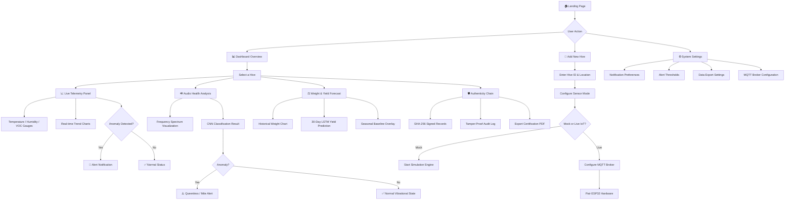
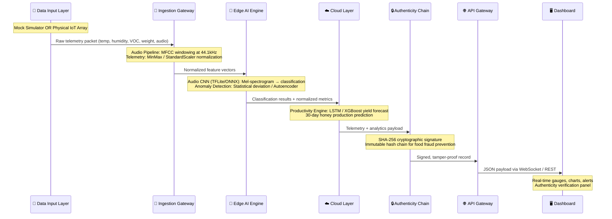

# 🐝 Smart Hive AI-IoT — User Flow & Technical Operations

## 1. User Flow Diagram

---

## 2. Complete Technical Operations Flow

---

## 3. Data Pipeline — Packet Lifecycle

| Stage | Operation | Input | Output | Latency Target |
|:---|:---|:---|:---|:---|
| **1. Capture** | Sensor read / Mock generation | Raw analog/digital signals | JSON telemetry packet | < 50ms |
| **2. Ingest** | MFCC windowing + normalization | Raw packet | Normalized feature vector | < 100ms |
| **3. Edge Inference** | Audio CNN + Anomaly detection | Feature vector | Classification label + confidence | < 200ms |
| **4. Cloud Prediction** | LSTM / XGBoost yield model | Historical weight series | 30-day yield forecast (kg) | < 500ms |
| **5. Sign** | SHA-256 hash chain | Telemetry + analytics | Signed immutable record | < 10ms |
| **6. Deliver** | WebSocket push to dashboard | Signed record | Real-time UI update | < 50ms |

---

## 4. Alert Escalation Matrix

| Condition | Metric Trigger | Severity | User Action |
|:---|:---|:---|:---|
| **High VOC** | VOC > 300 ppm | 🔴 CRITICAL | Investigate for Foulbrood decomposition |
| **Temperature Drop** | Temp < 32°C | 🟡 WARNING | Check brood cluster integrity |
| **High Humidity** | Humidity > 80% | 🟡 WARNING | Inspect for Chalkbrood / ventilation |
| **Acoustic Anomaly** | Freq < 160 Hz | 🔴 CRITICAL | Possible mite infestation or queenless colony |
| **Weight Loss** | Δ Weight < -1kg/day | 🟠 HIGH | Possible robber bee intrusion or swarm |
| **Normal** | All within range | 🟢 OK | No action required |

---

## 5. System Modules

### Module A — Mock Data Engine (`SmartHiveSimulator`)
- Generates lifelike multi-modal telemetry
- Supports health states: `Healthy`, `Foulbrood`, `Chalkbrood`
- Produces: temperature, humidity, weight, VOC, 100-point audio feature array
- Runs on configurable intervals (default: every 15 seconds for demo)

### Module B — Edge AI Engine (`HivePredictiveModel`)
- **Audio CNN**: Classifies mean frequency → Normal vs. Anomaly (threshold: 160 Hz)
- **Yield LSTM**: Linear forecast from historical weight deltas → 30-day projection
- Extensible to TFLite/ONNX for microcontroller deployment

### Module C — Authenticity Chain (`AuthenticityChain`)
- SHA-256 deterministic signing of telemetry + analytics
- Produces tamper-proof JSON records
- Designed for honey origin verification and food fraud prevention

### Module D — Dashboard (`Web Application`)
- Real-time WebSocket data streaming
- Interactive gauges, charts, and hive cards
- Alert notification system with severity levels
- Authenticity audit log viewer
- Multi-hive management

---

## 6. Technology Stack

| Layer | Technology |
|:---|:---|
| **Frontend** | HTML5, CSS3 (Glassmorphism), Vanilla JS, Chart.js |
| **Backend** | Node.js with Express (REST + WebSocket) |
| **AI/ML** | Python (NumPy, mock CNN/LSTM), future: TensorFlow Lite |
| **Data Signing** | SHA-256 (hashlib) |
| **IoT Protocol** | MQTT (paho-mqtt) for live hardware mode |
| **Hardware** | ESP32-S3, SHT31-D, SPH0645, HX711, MQ-135 |
